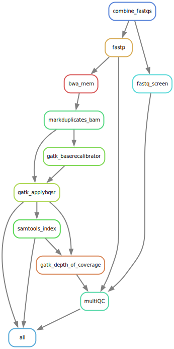

# BWA alignment and GATK preprocessing

Jump to section:
1. [Overview](#overview)
	1. [Pipeline steps](#pipeline-steps)
1. [Config Options](#config-options)

## Overview

This pipeline will run from unaligned fastq files to duplicate marked, recalibrated bam files.

### Pipeline steps

1. Quality Check
	1. fastp is used to check the raw fastq files as well as running adapter and quality trimming.
        1. fastq_screen screens the raw fastq for reads aligning to other genomes.
2. Trimmed fastq files are aligned to the reference geneome (set in the config file) using bwa mem.
3. samtools flagstat extracts the alignment stats from the raw bam.
4. Picard markduplicates (GATK) is used to mark potential PCR duplicates
5. GATK is used to recalibrate the base quality scores
	6. BQSR is used to generate a model for the analysis
 	7. ApplyBSQR is used to apply this model
6. GATK depth of coverage generates coverage statistics (using supplied interval file)
7. MultiQC collects all the QC metrics from the pipeline.

## Config options

Option | Notes
--- | ---
**Memory Options** | 

