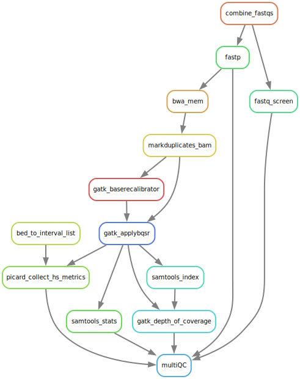

# BWA alignment and GATK preprocessing

Jump to section:
1. [Overview](#overview)
	1. [Quality Control](#Quality-Control)
	2. [Alignment](#Alignment)
1. [Config Options](#config-options)

# Overview

This pipeline will run from unaligned fastq files to duplicate marked, recalibrated bam files.

## Quality Control

*fastp version: 0.23.4*\
*fastq screen version: 0.15.3*

1. **[fastp](https://github.com/OpenGene/fastp)** is used to check the raw fastq files as well as running adapter and quality trimming. The pipeline uses the trimmed files downstream by default.
2. **[fastq_screen](https://www.bioinformatics.babraham.ac.uk/projects/fastq_screen/)** screens the raw fastq for reads aligning to other genomes. This allows you to test for contaimination in your samples.
	1. The file: /data/BCI-OkosunLab/Ref/FASTQ_Screen/fastq_screen.conf controls which genomes are used.
	2. By default it uses the following genomes:

Genome | Version | Origin
--- | --- | ---
Human | GRCh38 (hg38) | Ensembl
Mouse | GRCm39 (mm10) | Ensembl
Mycobacterium tuberculosis | H37Rv | NCBI
Escherichia coli | MG1655 | NCBI
Staphylococcus aureus | NCTC 8325 | NCBI

## Alignment

*bwa version: 0.7.17*\
*GATK version: 4.5.0*\
*samtools version: 1.19.2-0*\
*multiQC version: 1.21-0*

1. Trimmed fastq files are aligned to the reference geneome (set in the config file) using **[bwa mem](https://github.com/lh3/bwa)**.
2. **[Picard markduplicates](https://gatk.broadinstitute.org/hc/en-us/articles/21905036102043-MarkDuplicates-Picard)** (GATK) is used to mark potential PCR duplicates
5. GATK is used to recalibrate the base quality scores
	1. **[BQSR](https://gatk.broadinstitute.org/hc/en-us/articles/21905050792603-BaseRecalibrator)** is used to generate a model for the analysis
 	2. **[ApplyBSQR](https://gatk.broadinstitute.org/hc/en-us/articles/21905038144155-ApplyBQSR)** is used to apply this model
3. **[samtools flagstat](http://www.htslib.org/)** extracts the alignment stats from the raw bam.
6. **[GATK depth of coverage](https://gatk.broadinstitute.org/hc/en-us/articles/21905133224859-DepthOfCoverage-BETA)** generates coverage statistics (using supplied interval file)
7. **[MultiQC](https://multiqc.info/)** collects all the QC metrics from the pipeline.

## Config options

Option | Notes
--- | ---
**Memory Options** | 

