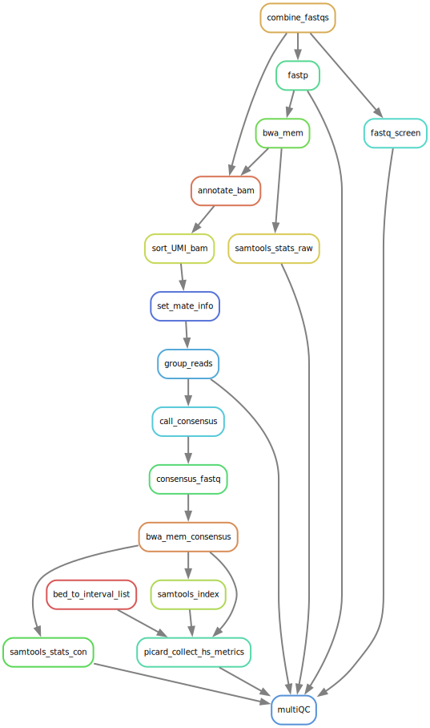

# UMI consensus alignment

Jump to section:
1. [Overview](#overview)
	1. [Pipeline steps](#pipeline-steps)
1. [Config Options](#config-options)

## Overview

This pipeline will run from unaligned fastq files to consensus bam files.

### Pipeline steps

1. Quality Check
	1. fastp is used to check the raw fastq files as well as running adapter and quality trimming.
	1. fastq_screen screens the raw fastq for reads aligning to other genomes.
2. trimmed fastq files are aligned to the reference geneome (set in the config file) using bwa mem.
3. samtools flagstat extracts the alignment stats from the raw bam.
4. fgbio is used to add UMIs to the bam files.
	1. UMIs are added.
	2. The bam file is sorted.
	3. Mate info is set.
 	4. Reads are grouped by their UMIS (the number of UMIs per family is recorded at this step).
  	5. The consensus is called for UMI marked PCR duplicates.
5. samtools is used to convert this bam file back into a consensus fastq file.
6. Consensus fastq files are aligned to the reference geneome (set in the config file) using bwa mem.
   1. The resulting file is coordinate sorted by samtools
7. multiqc collects all the QC metrics from the pipeline.

## Config options

Option | Notes
--- | ---
reference | Reference genome
dict | dictionary for that reference genome
knownsites | High quality SNP/indel calls
bwa_index | location of index for BWA
intervals | list of intervals for depth of coverage to look over
rawFolder | folder containing the raw fastq files
**Memory Options** | 
combineMem | Memory used for combining fastqs (don't need much)
trimMem | Memory used for fastq trimming
fastpMem | Memory used by fastp
fastqScreenMem | Memory for fastq screen
bwaMem | Memory for bwa mem
bwaThreads | Threads for bwa mem
fgbioMem | memory for fgbio
fgbioJavaMem | java limit on memory for fgbio (must be lower than fgbioMem or it use too much
consensusFastqMem | Memory for generating the consensus fastq
gatkMem | memory for GATK
gatkRunMem | memory for GATK to actually use (in MB)
samtoolsStatMem | memory for samtools flagstat
samtoolsIdxMem | memory for samtools index

