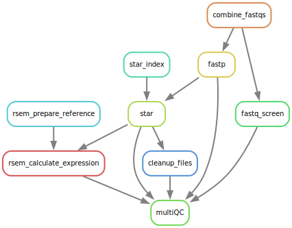

# STAR alignment and Counting

## Contents
1. [Overview](#overview)
	1. [Pipeline Steps](#Pipeline-steps)
	2. [Quality Control](#Quality-Control)
	3. [Alignment](#Alignment)
1. [Input](#sample-sheet)
1. [Output](#output)
1. [Config Options](#config-options)

# Overview

This pipeline will run from unaligned fastq files to duplicate marked, recalibrated bam files.

## Pipeline Steps

## Quality Control

*fastp version: 0.23.4*\
*fastq screen version: 0.15.3*

1. **[fastp](https://github.com/OpenGene/fastp)** is used to check the raw fastq files as well as running adapter and quality trimming. The pipeline uses the trimmed files downstream by default.
2. **[fastq_screen](https://www.bioinformatics.babraham.ac.uk/projects/fastq_screen/)** screens the raw fastq for reads aligning to other genomes. This allows you to test for contamination in your samples.
	1. The file: /data/BCI-OkosunLab/Ref/FASTQ_Screen/fastq_screen.conf controls which genomes are used.
	2. By default it uses the following genomes:

Genome | Version | Origin
--- | --- | ---
Human | GRCh38 (hg38) | Ensembl
Mouse | GRCm39 (mm10) | Ensembl
Mycobacterium tuberculosis | H37Rv | NCBI
Escherichia coli | MG1655 | NCBI
Staphylococcus aureus | NCTC 8325 | NCBI

## Alignment

*star version: 2.7.11b*

**[STAR](https://github.com/alexdobin/STAR/releases)** is used in two pass mode to align the trimmed FASTQ and count the reads aligned to genes.

## RSEM

*rsem version: 1.3.3*

**[RSEM](https://github.com/deweylab/RSEM)** is used for gene and isoform level quantification.

# Sample sheet

You need to have the sample IDs in a file like the below (see the example sample sheet):

sample | 
--- | 
sampleA | 
sampleB | 

# Output

The pipeline will output the aligned bams in a folder called Alignment. 
STAR quants will be stored in the directory: Expression/STAR/
RSEM quants will be stored in the directory: RSEM
QC files will be stored in the folder QC/
a summary of all the QC records will be generated at: QC/MultiQC/

# Config options

Option | Description | Default| Notes
--- | --- | --- | ---
reference | reference fasta | /data/BCI-OkosunLab/Ref/GRCh38/GATK_resource_bundle/Homo_sapiens_assembly38.fasta |
gtf | gtf for ref | /data/BCI-OkosunLab/Ref/GRCh38/GATK_resource_bundle/hg38.UCSC.ensGene.gtf
index | index for STAR | /data/BCI-OkosunLab/Ref/GRCh38/GATK_resource_bundle/Star.2.7.11b/
overhang | for index generation | 100
rawFolder | location of raw files | FASTQ_Raw |
SampleSheet | sample sheet for the samples | Sample.Sheet.tsv |
multiqcThreads | threads | 1 |
multiqcMem | memory | 4G |
multiqcTime | time | 24:0:0 | 24 hours
combineThreads | threads | 1 |
combineMem | memory | 8G |
combineTime | time | 24:0:0 | 24 hours
fastqScreenThreads | threads | 8 |
fastqScreenMem | memory | 8G |
fastqScreenTime | time | 24:0:0 | 24 hours
fastpThreads | threads | 1 |
fastpMem | memory | 24G |
fastpTime | time | 24:0:0 | 24 hours
starThreads | threads | 8 |
starMem | memory | 12G |
starTime | time | 24:0:0 | 24 hours
starIdxThreads | threads | 8 |
starIdxMem | memory | 12G |
starIdxTime | time | 24:0:0 | 24 hours
rsemPrepThreads | threads | 4 |
rsemPrepMem | memory | 8G |
rsemPrepTime | time | 24:0:0 | 24 hours
rsemRunThreads | threads | 4 |
rsemRunMem | memory | 8G |
rsemRunTime | time | 24:0:0 | 24 hours

