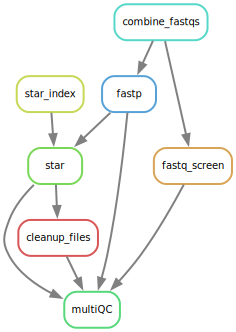

# STAR alignment and Counting

## Contents
1. [Overview](#overview)
	1. [Pipeline Steps](#Pipeline-steps)
	2. [Quality Control](#Quality-Control)
	3. [Alignment](#Alignment)
1. [Input](#sample-sheet)
1. [Output](#output)
1. [Config Options](#config-options)

# Overview

This pipeline will run from unaligned fastq files to duplicate marked, recalibrated bam files.

## Pipeline Steps

## Quality Control

*fastp version: 0.23.4*\
*fastq screen version: 0.15.3*

1. **[fastp](https://github.com/OpenGene/fastp)** is used to check the raw fastq files as well as running adapter and quality trimming. The pipeline uses the trimmed files downstream by default.
2. **[fastq_screen](https://www.bioinformatics.babraham.ac.uk/projects/fastq_screen/)** screens the raw fastq for reads aligning to other genomes. This allows you to test for contamination in your samples.
	1. The file: /data/BCI-OkosunLab/Ref/FASTQ_Screen/fastq_screen.conf controls which genomes are used.
	2. By default it uses the following genomes:

Genome | Version | Origin
--- | --- | ---
Human | GRCh38 (hg38) | Ensembl
Mouse | GRCm39 (mm10) | Ensembl
Mycobacterium tuberculosis | H37Rv | NCBI
Escherichia coli | MG1655 | NCBI
Staphylococcus aureus | NCTC 8325 | NCBI

## Alignment

# Sample sheet

You need to have the sample IDs in a file like the below (see the example sample sheet):

sample | 
--- | 
sampleA | 
sampleB | 

# Output

The pipeline will output the aligned bams in a folder called Alignment. QC files will be stored in the folder QC, with a subfolder called MultiQC which contains a summary of all the QC records. 

# Config options

Option | Description | Default| Notes
--- | --- | --- | ---
reference | reference fasta | /data/BCI-OkosunLab/Ref/GRCh38/GATK_resource_bundle/Homo_sapiens_assembly38.fasta |
dict | reference dictionary | /data/BCI-OkosunLab/Ref/GRCh38/GATK_resource_bundle/Homo_sapiens_assembly38.dict |
bwa_index | index for BWA | /data/BCI-OkosunLab/Ref/GRCh38/GATK_resource_bundle/Homo_sapiens_assembly38.fasta |
knownsites | gold standard SNV and indel positions | [ /data/BCI-OkosunLab/Ref/GRCh38/GATK_resource_bundle/Homo_sapiens_assembly38.dbsnp138.vcf,/data/BCI-OkosunLab/Ref/GRCh38/GATK_resource_bundle/1000G_phase1.snps.high_confidence.hg38.vcf.gz,/data/BCI-OkosunLab/Ref/GRCh38/GATK_resource_bundle/Mills_and_1000G_gold_standard.indels.hg38.vcf.gz ] | 
intervals | bed file of targeted positions | /data/BCI-OkosunLab/Ref/GRCh38/Nonacus_Exome_GRCh38/Nonacus_Exome_GRCh38_covered.chr.bed |
rawFolder | location of raw files | FASTQ_Raw |
SampleSheet | sample sheet for the samples | Sample.Sheet.tsv |
multiqcThreads | threads | 1 |
multiqcMem | memory | 4G |
multiqcTime | time | 24:0:0 | 24 hours
combineThreads | threads | 1 |
combineMem | memory | 8G |
combineTime | time | 24:0:0 | 24 hours
fastqScreenThreads | threads | 8 |
fastqScreenMem | memory | 8G |
fastqScreenTime | time | 24:0:0 | 24 hours
fastpThreads | threads | 1 |
fastpMem | memory | 24G |
fastpTime | time | 24:0:0 | 24 hours
bwaThreads | threads | 8 |
bwaMem | memory | 4G |
bwaTime | time | 24:0:0 | 24 hours
markDupsMem | memory | 8G |
markDupsThreads | threads | 1 |
markDupsTime | time | 24:0:0 | 24 hours
consensusFastqThreads | threads | 3 |
consensusFastqMem | memory | 8G |
consensusTime | time | 24:0:0 | 24 hours
gatkThreads | threads | 1 |
gatkMem | memory | 16G |
gatkRunMem | memory (passed to java) | 12288 |
gatkTime | time | 24:0:0 | 24 hours
samtoolsStatThreads | threads | 1 |
samtoolsStatMem | memory | 8G |
samtoolsStatTime | time | 24:0:0 | 24 hours
samtoolsIdxThreads | threads | 4 |
samtoolsIdxMem | memory | 8G |
samtoolsIdxTime | time | 24:0:0 | 24 hours
picardThreads | threads | 1 |
picardMem | memory | 8G |
picardTime | time |  24:0:0 | 24 hours

