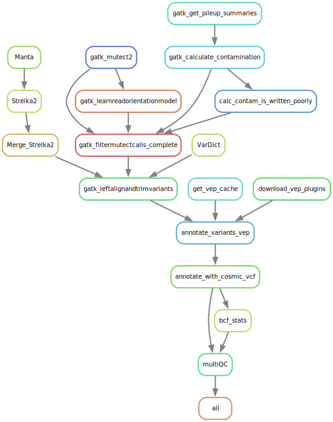

# Tumour normal variant calling

This snakemake pipeline takes a sample sheet of matched tumour/normal samples and run a selection of somatic variant calling pipelines. 

# Overview of the pipeline:



## Variant Calling

### [Mutect2](https://gatk.broadinstitute.org/hc/en-us/articles/27007991962907-Mutect2)

*GATK version: 4.5.0.0*

GATK's somatic caller is used as per their best practices workflow. *Mutect2* is run to generate the VCF file. Simultaneously *GetPileupSummaries* is run, the output of which is fed into *CalculateContamination*. *CalculateContamination* creates a contamination table as well as segmentation information. Because the wrapper for this doesn't allow you to tell snakemake that the segmentation file is generated in this rule there is another rule called *cleanup_calc_contamination* the sole purpose of this is to recognise that calculate contamination has finished (because the contamination table has been generated) and have the segmentation file as an output (**N.B.** this step doesn't generate anything, but without it snakemake doesn't know where the segmentation file is generated). *LearnReadOrientationModel* is run generating the artifacts prior file. These files are all then fed into *FilterMutectCalls*, generating the final vcf file ready for annotation.

### [Strelka2](https://github.com/Illumina/strelka)

*Manta version: 1.6.0*\
*Strelka2 version: 2.9.10*

The SV caller Manta is run first to generate candidate indels for Strelka2. These are passed to Strelka2 as in the best practices.

### [Varscan2](http://dkoboldt.github.io/varscan/)

*Samtools version: 1.20*\
*Varscan2 version: 2.4.6*

Pileup files are created using Samtools. The snakemake wrapper for this ONLY allows gzipped outputs, but varscan somatic fails if given compressed pileup files. The gunzip intermediate step ungzips the pileup file so Varscan can run on it. varscan is then run in somatic mode with the following option to generate a VCF file instead of Varscan's default output:

```bash
--output-vcf 1
``` 

### [VarDict](https://github.com/AstraZeneca-NGS/VarDict)

*VarDict version: 1.8.3*

VarDict is run in paried mode on the Bam files directly.

## Annotation

### Normalisation 

*GATK version: 4.5.0.0*

GATKs LeftAlignAndTrimVariants is run on each VCF from the callers above to esure that indel positions are left aligned. At this stage multiallelic sites are also split into separate rows.

### Annotation

*VEP version: 111.0*

Annotation is carried out using Ensembl's [Variant Effect Predictor (VEP)](https://www.ensembl.org/info/docs/tools/vep/index.html). By default this will use the data for Homo Sapiens GRCh38, release 112, though this can be changed in the config options. 

#### COSMIC annotation
Due to licencing restrictions, the [Catalogue Of Somatic Mutations In Cancer (COSMIC)](https://cancer.sanger.ac.uk/cosmic/) versions later than v70 (Aug 2014) cannot be provided by tools. As such tools like Annovar come with the outdated version 70, whilst tools like VEP contain a more recent version of COSMIC, but cannot do allele matching (i.e. some of the annotated COSMIC IDs will not match the called variant allele). One solution to this is to download a copy of COSMIC and annotate from it directly.

Here BCFtools is used to annotate the variant calls with the COSMIC ID from a provided VCF file. By default this is a merged copy of the genome, non coding and targeted calls from version 100, using GRCh38 coordinates. These IDs will be added to the 3rd (ID) column of the VCF files.

**NB** As these calls were manually downloaded you should double check your annotated IDs to make sure they have been processed correctly. They will also not match *all* of the "EXISTING VARIANTS" called by VEP as some of these will be called with the wrong allele.

# Config options:
