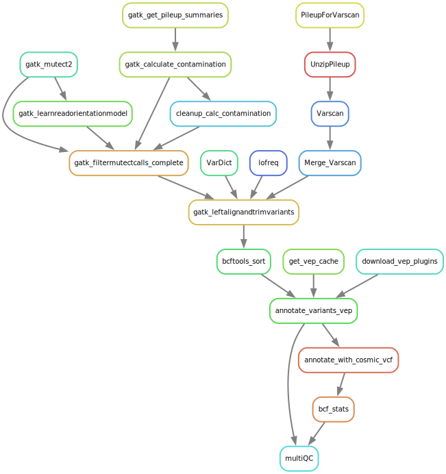

# Tumour only variant calling

## Contents

1. [Overview](#Overview-of-the-pipeline)
   1. [Variant Calling](#Variant-Calling)
      1. [Mutect2](#Mutect2)
      2. [Varscan2](#Varscan2)
      3. [VarDict](#VarDict)
      4. [LoFreq](#LoFreq)
   2. [Annotation](#Annotation)
      1. [Normalisation](#Normalisation)
      2. [Annotation](#Annotation)
      3. [A note on COSMIC annotation](#COSMIC-annotation)
4. [Config Options](#Config-options)

# Overview of the pipeline:

This snakemake pipeline takes a sample sheet of tumour samples and runs a selection of somatic variant calling pipelines. 

## Pipeline Steps



## Variant Calling

### [Mutect2](https://gatk.broadinstitute.org/hc/en-us/articles/27007991962907-Mutect2)

*GATK version: 4.5.0.0*

1. GATK's somatic caller is used as per their best practices workflow. *Mutect2* is run to generate the VCF file. 
2. Simultaneously *GetPileupSummaries* is run, the output of which is fed into *CalculateContamination*. 
3. *CalculateContamination* creates a contamination table as well as segmentation information.
   1. Because the wrapper for this doesn't allow you to tell snakemake that the segmentation file is generated in this rule there is another rule called *cleanup_calc_contamination* the sole purpose of this is to recognise that calculate contamination has finished (because the contamination table has been generated) and have the segmentation file as an output (**N.B.** this step doesn't generate anything, but without it snakemake doesn't know where the segmentation file is generated).
4. *LearnReadOrientationModel* is run generating the artifacts prior file.
5. These files are all then fed into *FilterMutectCalls*, generating the final vcf file ready for annotation.
6. *FilterMutectCalls* is run with the option:

```bash
--max-alt-allele-count 3
```
This stops it from labelling **all** multiallelic variants as multiallelic in the FILTER column, meaning they are removed when subsetting by PASS.


### [Varscan2](http://dkoboldt.github.io/varscan/)

*Samtools version: 1.20*\
*Varscan2 version: 2.4.6*\
*BCFtools version: 1.20-0*

1. Pileup files are created using Samtools.
2. The gunzip intermediate step ungzips the pileup file so Varscan can run on it.
3. Varscan is then run in pileup2snp and pileup2indel mode with the following option to generate a VCF file instead of Varscan's default output:

```bash
--output-vcf 1
```

4. BCFtools is used to merge the snp and indel files
   1. This step requires bgziped VCF files, so first BCFtools is used to bgzip and index the snv and indel outputs from varscan
   2. The files are merged

### [VarDict](https://github.com/AstraZeneca-NGS/VarDict)

*VarDict version: 1.8.3*

VarDict is run in paried mode on the bam files directly, producing the VCF file.

**N.B.** Vardict will also call large structural variants (>1000bp). These are denoted by \<DEL\>, \<INS\>, \<DUP\> and \<INV\>. These will not be annotated with VEP.

### [LoFreq](https://csb5.github.io/lofreq/)

*LoFreq version: 2.1.5*

LoFreq is run on the tumour bam file directly producing the VCF file.

## Annotation

### Normalisation 

*GATK version: 4.5.0.0*

GATKs LeftAlignAndTrimVariants is run on each VCF from the callers above to esure that indel positions are left aligned. At this stage multiallelic sites are also split into separate rows.

### Annotation

*VEP version: 111.0*

Annotation is carried out using Ensembl's [Variant Effect Predictor (VEP)](https://www.ensembl.org/info/docs/tools/vep/index.html). By default this will use the data for Homo Sapiens GRCh38, release 112, though this can be changed in the config options. 

#### COSMIC annotation
Due to licencing restrictions, the [Catalogue Of Somatic Mutations In Cancer (COSMIC)](https://cancer.sanger.ac.uk/cosmic/) versions later than v70 (Aug 2014) cannot be provided by tools. As such tools like Annovar come with the outdated version 70, whilst tools like VEP contain a more recent version of COSMIC, but cannot do allele matching (i.e. some of the annotated COSMIC IDs will not match the called variant allele). One solution to this is to download a copy of COSMIC and annotate from it directly.

Here BCFtools is used to annotate the variant calls with the COSMIC ID from a provided VCF file. By default this is a merged copy of the genome, non coding and targeted calls from version 100, using GRCh38 coordinates. These IDs will be added to the 3rd (ID) column of the VCF files.

**NB** As these calls were manually downloaded you should double check your annotated IDs to make sure they have been processed correctly. They will also not match *all* of the "EXISTING VARIANTS" called by VEP as some of these will be called with the wrong allele.
# Sample sheet

To make sure the samples are paired with their correct normals I implemented a sample sheet approach. This sheet is run through some python code to generate a dictionary with the sample ID as the key. This makes it easy to pull out various bits of information about the samples easily with only the sample ID.

To create a sample sheet to work with this pipeline you need a tab delimited file with the following columns (the column headers must match the names here).

sample | tumour | tumourID | normal | normalID
--- | --- |--- | --- |--- 
SampleA | Alignment/SampleA.bam | SampleA | Alignment/SampleA.normal.bam | SampleA.normal

The IDs are used for variant callers that accept all the bams at once and then use the RG inside the bam to work out which reads come from tumor and which from normal. You can see and example in the Sample.Sheet.tsv.

Column | Reason
--- | ---------------
sample | Sample ID - MUST BE unique to this sample
tumour | tumour bam file
tumourID | ID for the tumour bam (this is in your bam header) **N.B. this should be the same as sample if you have used my pipeline**
normal | normal bam file
normalID | ID for the normal bam (see above)

# Config options:

These options are avaliable in the config file. Ideally you should not have to alter the snake file at all, and everything you might need to change should be in the config file. Put in an issue here if you want to add more options to this.

Option | description | Default | Note
--- | --- | --- | ---
reference | Reference | /data/BCI-OkosunLab/Ref/GRCh38/GATK_resource_bundle/Homo_sapiens_assembly38.fasta |
gnomad | gnomad variant calls | /data/BCI-OkosunLab/Ref/GRCh38/GATK_resource_bundle/af-only-gnomad.hg38.vcf.gz |
intervals | intervals for your calls (bedfile) | /data/BCI-OkosunLab/Lizzie/20240627.FFPE.targetedpanel.PTCL.deidentified/PanelBedFiles/T.cell.panel.revised._covered.bed |
pon | panel of normals | /data/BCI-OkosunLab/Ref/GRCh38/GATK_resource_bundle/1000g_pon.hg38.vcf.gz |
SampleSheet | sheet of sample information (see above) | Sample.Sheet.tsv |
callers | which variant callers to run | \[Mutect2,VarDict,LoFreq,Varscan2\] |
vepCache | Location for VEP cache download | /data/BCI-OkosunLab/Ref/GRCh38/vep/cache |
vepSpecies | species | homo_sapiens |
vepBuild | genome version | GRCh38 |
vepRelease | ensembl release | 112 |
pickOrder | order for annotation choice | mane_select,mane_plus_clinical,canonical,biotype,rank,tsl,appris,ccds,length |
bcftoolsVCF | Cosmic VCF file | /data/BCI-OkosunLab/Ref/GRCh38/COSMIC/Cosmic_Genome.Targeted.NonCoding.Merged._Normal_v100_GRCh38.chr.vcf.gz |
multiqcThreads | threads | 1 |
multiqcMem | mem | 4G |
multiqcTime | time | 24:0:0 |
prepMem | mem | 8G |
prepThreads | threads | 1 |
prepTime | time | 24:0:0 |
mutect2Threads | threads | 1 |
gatkMem | mem | 24G |
gatkRunMem | run mem | 22000 |
gatkTime | time | 24:0:0 |
lofreqMem | mem | 8G |
lofreqTime | time | 24:0:0 |
lofreqThreads | threads | 8 |
bcftoolsMem | mem | 8G |
bcftoolsMemFloat | run mem | 7168 |
bcftoolsThreads | threads | 1 |
bcftoolsTime | time | 24:0:0 |
laatvThreads | threads | 1 |
vepThreads | threads | 4 |
vepMem | mem | 8G |
vepTime | time | 24:0:0 |
VarDictMem | mem | 24G |
vardictThreads | threads | 1 |
vardictTime | time | 24:0:0 |
varscanResMem | run mem | 7168 |
varscanMem | mem | 8G |
varscanThreads | threads | 1 |
varscanTime | time | 24:0:0 |
pileupMem | mem | 8G |
pileupThreads | threads | 1 |
pileupTime | time | 24:0:0 |
